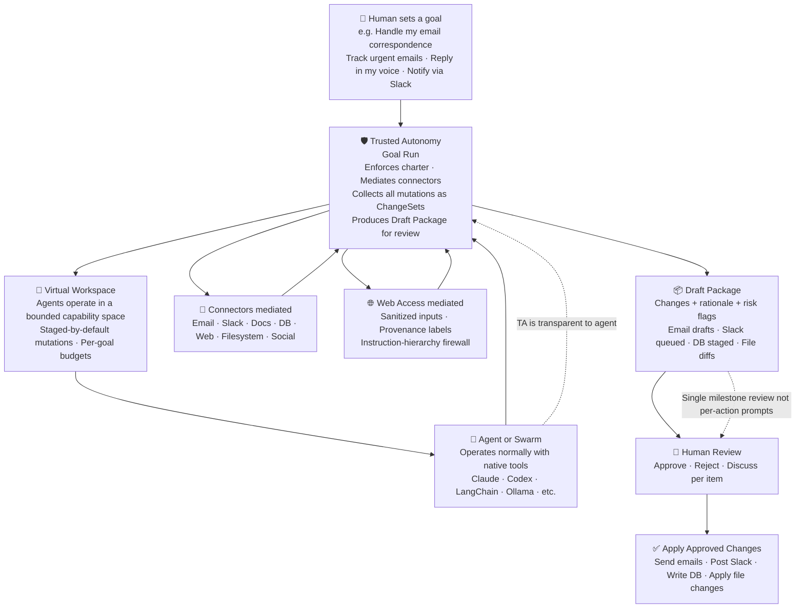
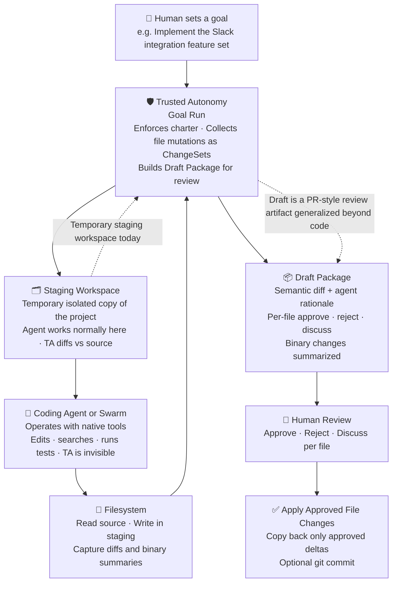

<p align="center">
  
</p>

<h1 align="center">Trusted Autonomy</h1>

<p align="center">
  <a href="https://github.com/Trusted-Autonomy/TrustedAutonomy/releases/latest">
    
  </a>
  <a href="https://github.com/Trusted-Autonomy/TrustedAutonomy/releases/tag/nightly">
    
  </a>
  
</p>

**Trusted Autonomy** is a wrapper to *safely* run autonomous AI agent workflows **with human review**, and **without changing how agents behave**.

It is not an agent framework. Use Claude, Codex, a local LLM, or any agent system you want. 
Swap them with just a simple config change. Set a different agent framework for a workflow. Easily A/B test a workflow with two agents.

Trusted Autonomy governs how agents interact with the outside world without the agents knowing. They work as if they have full access. TA wraps them into a virtual space so writing files, DB operations, sending email, or posting to a website is captured.
The agent sees this modified version of the world. When a goal is complete, the human is notified to review a **draft** of all changes. Approving the draft makes the agents changes in the real world. The human can reject or correct the agent's work before it actually hits your project.

TA ensures:
- agents operate autonomously inside a defined charter
- all real-world effects are staged, reviewable, and auditable
- humans remain in control at meaningful boundaries (a draft at each milestones in simple English with detailed diffs for deep inspection)
- orchestration layers remain swappable and unaware of the substrate



---

## Why Trusted Autonomy

Today's agent tooling forces trade-offs between security and convenience; many people opt for convenience. This shouldn't be the choice for tech and non-tech users alike. Default behavior is locked down requiring **constant permission prompts** (secure but annoying) or folder level access that stil requires many approvals with options to "always allow". An all too common alternative, or the result of many "yeah, always allow" choices is **full auto-approve** (convenient but risky). Users get tired of approving seemingly trivial actions, needing to constantly check and babysit their smart agents, and disable safeguards — many users without understanding the security consequences. Experienced users can configure fine-grained tool permissions in frameworks like Claude Code or Claude Flow, but doing this well requires knowing which actions are actually dangerous, how they interact, and what to scope — a level of security reasoning that shouldn't be a prerequisite for safe agent use.

The standard answer is to run agents inside a VM with strict network controls and file access mappings. That works, but it requires a reasonable amount of technical sophistication to manage correctly, requires some customization per workflow, and requires some knowledge to track and review diffs - all of which is time not focused on the users goal. There are two classes of problem to solve: malicious intent (purposefully built Claude skills to cause harm as witnissed in recent Clawdbot security scans), and well-intentioned AI doing the wrong thing for the "right" reasons. VMs solve the former, humans have to engage to solve the latter. TA helps with both.

TA takes a different approach:

- **Agents work freely** in a staging copy of your project using their native tools. No permission prompts, no special APIs. TA is invisible to the agent.
- **Nothing reaches the real world** until you review and approve. TA diffs the staging copy against the original and presents changes as a Draft-style package — with the agent's rationale for each file.
- **You review at goal completion**, not per-action. This is the right abstraction: let the agent finish the task, then evaluate the result as a whole.
- **Selective approval**: accept the code changes, reject the config changes, discuss the rest. Not all-or-nothing.
- **Any agent, no lock-in**: Claude Code, Codex, Claude Flow, or any future agent works on top without modification.
- **Layers with VMs and sandboxes** when warranted — TA adds the semantic review layer that containers alone can't provide.

Today TA mediates filesystem changes. The same staging model in future releases extends to any state change actions including email drafts, database writes, API calls, and any external action — each becoming a reviewable artifact in the same Draft package.

> **[User Guide](docs/USAGE.md)** — quick start, workflows, configuration, and troubleshooting
> **[Roadmap](docs/USAGE.md#roadmap)** — what's done, what's next, and the vision
> **[PLAN.md](PLAN.md)** — detailed development plan with per-phase status
> **[WHY-TA-vs-VM.md](docs/WHY-TA-vs-VM.md)** — comparison of TA's approach vs VM sandboxing

---

## What this is (and is not)

### This **is**
- a runtime layer that abstracts all agent operations that change the state of your project
- a policy-enforced MCP gateway
- a staging and AI + Human review system for agent actions
- a foundation for high-autonomy workflows with human trust
- a workflow system to easily create and share multi-step workflows and what agents to run at each step

### This is **not**
- an “Agent OS VM”
- a replacement for LangGraph, Claude Flow, CrewAI, etc.
- a UI-first product (comes later but independently)
- a monolithic orchestration framework

---

## Current status: 0.15.24-alpha.2

Under active development. See [PLAN.md](PLAN.md) for the full roadmap.

This is an alpha release for feedback. Please note:

- **Not production-ready.** Do not use for critical or irreversible operations.
- **The security model is not yet audited.** Sandbox isolation exists (command allowlisting, path escape detection) but has not been independently audited. Do not trust it with secrets or sensitive data without your own review.

If any of these are blockers for your use case, watch the repo — progress is tracked on the [roadmap](PLAN.md).

---

## How the staging model works

Agents interact with a **staging workspace** — an isolated copy of your project — using their native tools (read, write, run tests). TA intercepts nothing at the OS level; it simply presents the staging copy as the workspace. All writes become **ChangeSets with diffs** bundled into a Draft package. Nothing touches the real project until you approve.

The staging approach is cross-platform, requires no kernel drivers or FUSE mounts, and gives each GoalRun complete isolation. Kernel-level VFS can be added later — staging keeps the system portable and maintainable.



---

## Why TA adds project orchestration and workflows

*"I thought TA wasn't an orchestrator?"*

TA is not an agent orchestrator — it does not replace LangGraph, CrewAI, or claude-flow. Those systems decide *what* agents do and in what order. TA decides *how governed execution works*: what can be staged, what requires human review, and what record is kept.

But governance without orchestration creates a safe system that nobody uses. If every multi-step plan requires a human to manually chain `ta run` → review → `ta run --follow-up` → review, then the operational burden of safety is unbounded. Users disable safeguards not because they don't want safety — they do — but because the cost of remaining safe exceeds the cost of the risk.

The two questions governance and orchestration each answer:

| | Governance | Orchestration |
|---|---|---|
| **Question** | Was this action safe? | Did the right things happen, in the right order? |
| **Role** | Gate | Map |
| **Without the other** | Safe but manually exhausting | Efficient but untrustworthy |

**Where they compound**: TA's orchestration layer makes governed workflows the *default operating model*, not a friction layer users have to work around.

### What orchestration adds to governance

**Serial phase chains** (`ta workflow serial-phases`): A multi-phase plan executes as a single invocation with configurable gates (build, test, clippy, custom command). If phase 3 fails tests, the workflow pauses and surfaces the failure. The human intervenes once — not six times.

**Parallel agent swarms** (`ta workflow swarm`): A large goal decomposes into concurrent sub-goals, each in its own governed staging environment. An integration agent merges results. Without safe parallel staging, this pattern requires either manual coordination or unreviewed auto-merge.

**Workflow routing**: Department configs map "engineering" → `serial-phases`, "content" → `editorial-pipeline`, "compliance" → `approval-chain`. The agent doesn't decide which governance model applies — the institution does, once, and it applies uniformly.

**Institutional process encoding**: Different teams, project types, and risk levels need different execution patterns. A legal document review is not the same as a code sprint. Workflow routing makes this explicit rather than leaving it to ad-hoc manual process.

> **TA's thesis**: safety and efficiency compound. Orchestration makes governed workflows the default operating model; governance ensures every orchestrated step is auditable and human-overridable. Governance is a gate. Orchestration is a map. Both are required for autonomy that organizations will actually trust.

---

## Quick Start (5 minutes)

### 1. Install TA

| Channel | Version | Downloads |
|---------|---------|-----------|
| **Stable** | [](https://github.com/Trusted-Autonomy/TrustedAutonomy/releases/latest) | [macOS · Linux · Windows](https://github.com/Trusted-Autonomy/TrustedAutonomy/releases/latest) |
| **Nightly** | [](https://github.com/Trusted-Autonomy/TrustedAutonomy/releases/tag/nightly) | [macOS · Linux · Windows](https://github.com/Trusted-Autonomy/TrustedAutonomy/releases/tag/nightly) · [History](https://github.com/Trusted-Autonomy/TrustedAutonomy/releases/tag/nightly#nightly-history) |

**Build from source:**

```bash
# Clone the repo
git clone https://github.com/Trusted-Autonomy/TrustedAutonomy.git
cd TrustedAutonomy

# Build (pick one):

# Option A — With Nix (reproducible, recommended for contributors)
nix develop --command cargo build --release -p ta-cli

# Option B — Without Nix (just needs Rust)
curl --proto '=https' --tlsv1.2 -sSf https://sh.rustup.rs | sh  # if needed
cargo build --release -p ta-cli
```

The binary lands at `target/release/ta`. Add it to your PATH:

```bash
# Add to your shell profile (~/.bashrc, ~/.zshrc, etc.)
export PATH="$HOME/path-to/ta/target/release:$PATH"
```

### 2. Install an agent

TA works with any coding agent. Pick one (or more):

**Claude Code** (recommended)
```bash
# Native install (preferred)
curl -fsSL https://claude.ai/install.sh | bash

# Or via npm
npm install -g @anthropic-ai/claude-code
```
Requires an [Anthropic API key](https://console.anthropic.com/) or a Claude Max plan.

**Claude Flow** (multi-agent orchestration on top of Claude Code)
```bash
# Requires Node.js 20+ and Claude Code installed first
npx claude-flow@alpha init --wizard

# Or full install
curl -fsSL https://cdn.jsdelivr.net/gh/ruvnet/claude-flow@main/scripts/install.sh | bash -s -- --full
```
See the [claude-flow repo](https://github.com/ruvnet/claude-flow) for configuration options.

**OpenAI Codex CLI**
```bash
npm install -g @openai/codex
```
Requires an [OpenAI API key](https://platform.openai.com/api-keys) or ChatGPT Plus/Pro subscription.

### API key configuration

You can set API keys globally or per-project.

**Global** (all projects):
```bash
# Add to ~/.bashrc or ~/.zshrc
export ANTHROPIC_API_KEY="sk-ant-..."
export OPENAI_API_KEY="sk-..."
```

**Per-project** (recommended — uses [direnv](https://direnv.net/)):
```bash
# Copy the example and add your key
cp .envrc.example .envrc
# Edit .envrc — uncomment and set your API key
direnv allow
```

The key activates when you `cd` into the project and deactivates when you leave. The `.envrc` also contains `use flake` which auto-activates the Nix dev shell (cargo, rustc, etc.).

**Important:** `.envrc` is already in `.gitignore` — your keys will never be committed. Only `.envrc.example` (with placeholder values) is tracked in git.

### 3. Run your first mediated task

```bash
cd your-project/

# One command: create staging copy → launch agent → build Draft on exit
ta run "Fix the auth bug"

# Uses Claude Code by default. For other agents:
ta run "Fix the auth bug" --agent claude-flow

# TA copies your project to .ta/staging/, injects context into CLAUDE.md,
# launches the agent in the staging copy. Agent works normally.
# When the agent exits, TA diffs staging vs source and builds a Draft package.

# Review what the agent did
ta draft list
ta draft view <package-id>

# Approve and apply changes back to your project
ta draft approve <package-id>
ta draft apply <package-id> --git-commit
```

That's it. The agent never knew it was in a staging workspace.

> **For detailed usage, configuration options, and troubleshooting, see [docs/USAGE.md](docs/USAGE.md)** or run `ta --help`.

---

## Step-by-Step Workflow

### Manual workflow (any agent)

```bash
# 1. Start a goal — creates a staging copy of your project
ta goal start "Fix the auth bug"

# 2. Note the staging path and goal ID from the output, then enter staging
cd .ta/staging/<goal-id>/

# 3. Launch your agent (Claude Code, Codex, or any tool)
claude    # or: codex, or any tool

# 4. Agent works normally — reads, writes, runs tests, etc.
#    It doesn't know it's in a staging workspace.
#    When done, exit the agent.

# 5. Build a Draft package from the diff
ta draft build <goal-id> --summary "Fixed the auth bug"

# 6. Review the changes
ta draft view <package-id>

# 7. Approve and apply back to your project (with optional git commit)
ta draft approve <package-id>
ta draft apply <package-id> --git-commit
```

### One-command shortcut

`ta run` wraps the manual steps into a single command:

```bash
ta run "Fix the auth bug"
# Uses Claude Code by default. For other agents:
ta run "Fix the auth bug" --agent claude-flow

# Follow-up on a previous goal to iterate on feedback:
ta run "Address config validation" --follow-up
# Automatically links to the most recent goal, includes parent context

# Follow-up with detailed review notes:
ta run --follow-up --objective-file review-notes.md
# Then review + approve + apply as above.
```

### Using with Claude Flow (detailed setup)

[Claude Flow](https://github.com/ruvnet/claude-flow) adds multi-agent orchestration on top of Claude Code. It can run as an MCP server (giving Claude Code extra tools for swarm coordination, memory, and task routing) or launch Claude Code processes directly via its hive-mind command. Both approaches work inside a TA staging workspace.

**Prerequisites:**
- Node.js 20+, npm 9+
- Claude Code installed (`npm install -g @anthropic-ai/claude-code`)
- An `ANTHROPIC_API_KEY` set in your environment

#### Step 1: Install claude-flow

```bash
# Option A: Use via npx (no global install needed)
npx claude-flow@alpha --version

# Option B: Global install
npm install -g claude-flow@alpha
```

#### Step 2: Register claude-flow as an MCP server for Claude Code

This is the primary integration — it gives Claude Code access to claude-flow's swarm, memory, and task-routing tools:

```bash
claude mcp add claude-flow -- npx claude-flow@alpha mcp start
```

Or add it to your project's `.mcp.json` (TA will copy this into staging):

```json
{
  "mcpServers": {
    "claude-flow": {
      "command": "npx",
      "args": ["claude-flow@alpha", "mcp", "start"]
    }
  }
}
```

#### Step 3: Create a TA goal and staging workspace

```bash
cd your-project/
ta goal start "Refactor auth system"
# Note the goal ID from the output
```

#### Step 4: Launch — pick one approach

**Approach A: TA run + MCP tools (recommended)**

Use `ta run` to launch Claude Code inside the staging workspace. Because claude-flow is registered as an MCP server, Claude Code can call swarm/memory/task tools automatically:

```bash
ta run "Refactor auth system"

# Claude Code (default agent) launches in .ta/staging/<goal-id>/
# It can use mcp__claude-flow__swarm_init, mcp__claude-flow__task_orchestrate,
# etc. alongside its normal tools.
# When Claude exits, TA diffs and builds the Draft package.
```

**Approach B: Hive-mind (spawns Claude Code directly)**

Claude-flow's `hive-mind` command spawns a real Claude Code process with the task prompt. You must initialize the hive-mind first:

```bash
cd .ta/staging/<goal-id>/
npx claude-flow@alpha hive-mind init       # required — sets up the hive mind
npx claude-flow@alpha hive-mind spawn "Refactor auth system" --claude
# Spawns Claude Code with --dangerously-skip-permissions in the staging dir.
# When done, return to project root and build the Draft:
cd your-project/
ta draft build <goal-id> --summary "Auth system refactored"
```

> **Note:** `ta run "task" --agent claude-flow` handles `hive-mind init` automatically.

**Approach C: Headless swarm (no interactive session)**

For fully automated runs:

```bash
cd .ta/staging/<goal-id>/
npx claude-flow@alpha swarm "Refactor auth system" --headless
# Runs to completion without interaction.
cd your-project/
ta draft build <goal-id> --summary "Auth system refactored by swarm"
```

#### Step 5: Review and apply

```bash
ta draft list
ta draft view <package-id>
ta draft approve <package-id>
ta draft apply <package-id> --git-commit
```

#### CLAUDE.md conflict note

Both TA and claude-flow write to `CLAUDE.md`. TA injects goal context and plan progress into CLAUDE.md when launching via `ta run`. If you use claude-flow's `init` command inside a staging directory, use `--skip-claude` to avoid overwriting TA's injected context:

```bash
cd .ta/staging/<goal-id>/
npx claude-flow@alpha init --minimal --skip-claude
# Sets up .claude-flow/ config without touching CLAUDE.md
```

If you need claude-flow's CLAUDE.md content (governance rules, skill definitions), append it to the existing file rather than replacing it:

```bash
npx claude-flow@alpha init --minimal --skip-claude
# Then manually merge any needed claude-flow instructions into CLAUDE.md
```

#### Environment variables

```bash
# Required
export ANTHROPIC_API_KEY="sk-ant-..."

# Optional claude-flow tuning
export CLAUDE_FLOW_LOG_LEVEL=info          # debug, info, warn, error
export CLAUDE_FLOW_MAX_AGENTS=12           # max concurrent agents
export CLAUDE_FLOW_NON_INTERACTIVE=true    # for CI/headless runs
export CLAUDE_FLOW_MEMORY_BACKEND=hybrid   # memory persistence backend
```

### Choosing your orchestration stack

TA, Claude Code's native multi-agent capabilities, and ruflow/claude-flow serve different layers. They are additive, not competing.

| Layer | Tool | What it does | When to add it |
|---|---|---|---|
| **Governance** | TA | Staged execution, policy gates, audit, draft review | Always — this is the substrate |
| **Agent runtime** | Claude Code / Codex / Ollama | Executes the work in the staging workspace | Always — pick one per goal |
| **Within-session parallelism** | Claude Code native `Agent` tool | Spawns subagents in parallel inside a single `ta run` — no extra install | When one goal needs concurrent subtasks (research + code + tests in parallel) |
| **Cross-session memory** | ruflow MCP server | Persists semantic embeddings (HNSW) and agent state across separate `ta run` invocations | When later goals need to recall findings from earlier runs |
| **Distributed coordination** | ruflow hive-mind | Byzantine consensus, mesh/hierarchical topology, agent pool routing | Multi-machine or multi-team deployments |

**For most goals**: TA + Claude Code, no ruflow needed. Claude Code's built-in `Agent` tool handles parallel subtasks natively.

**Add ruflow when**: you need memory that survives across separate `ta run` invocations (e.g., a multi-week research sprint where agent findings accumulate), or when coordinating agents across multiple machines.

**Valid combined stacks**:

```
# Stack 1: Most goals (simple or parallel within one session)
ta run "Refactor auth" --agent claude-code
# Claude Code uses native Agent tool internally for parallel subtasks

# Stack 2: TA workflow swarm (multiple governed staging envs in parallel)
ta run "Large refactor" --workflow swarm --sub-goals "auth" "payments" "UI"
# Each sub-goal = separate staging dir + separate Claude Code; no ruflow needed

# Stack 3: Cross-session memory (ruflow as MCP server)
ta run "Research phase 1" --agent claude-code
# → ruflow agentdb stores findings as HNSW embeddings
ta run "Research phase 2" --agent claude-code
# → Claude Code queries ruflow for phase 1 findings via mcp__claude-flow__memory_retrieve

# Stack 4: Full ruflow hive-mind (advanced, multi-machine)
ta run "Deploy pipeline" --agent claude-flow
# ruflow manages agent lifecycle + TA governs outputs
```

**Do not migrate away from ruflow** if you rely on persistent cross-session memory or distributed consensus. The native `Agent` tool is not a replacement — it operates within a single session only.

### Using with OpenAI Codex

```bash
# Same workflow — TA doesn't care which agent you use
ta goal start "Add input validation"
cd .ta/staging/<goal-id>/
codex    # Codex works in the staging copy like normal
# Exit Codex, then build/review/apply as above
```

### Exclude patterns (.taignore)

By default, TA excludes common build artifacts from the staging copy (`target/`, `node_modules/`, `__pycache__/`, etc.) to keep copies fast. To customize, create a `.taignore` file in your project root:

```
# .taignore — one pattern per line
# Lines starting with # are comments

# Rust
target/

# Custom project-specific excludes
large-data/
*.sqlite
```

If no `.taignore` exists, sensible defaults are used. The `.ta/` directory is always excluded.

---

## Review Workflow

```bash
ta draft list                            # List pending PRs
ta draft view <package-id>               # View details + diffs
ta draft approve <package-id>            # Approve
ta draft deny <package-id> --reason "x"  # Deny with reason
ta draft apply <package-id> --git-commit # Apply + commit
ta draft apply <package-id> --submit     # Apply + commit + push + open Draft

# Selective approval (approve some, reject/discuss others)
ta draft apply <id> --approve "src/**/*.rs" --reject "*.test.rs" --discuss "config/*"
ta draft apply <id> --approve all        # Approve everything
ta draft apply <id> --approve rest       # Approve everything not explicitly matched
```

### Workflow Automation (`.ta/workflow.toml`)

By default, `ta draft apply` only copies files back to your project. To automatically commit, push, and open a draf set of changes (e.g. a pull request in GIT terminology), you can either pass CLI flags each time or create a `.ta/workflow.toml` config file to set your preferences once.

**Option A: CLI flags (no config needed)**

```bash
ta draft apply <id> --git-commit         # Commit only
ta draft apply <id> --git-push           # Commit + push (implies --git-commit)
ta draft apply <id> --submit             # Commit + push + open Draft
```

**Option B: Config file (set once, always active)**

Create `.ta/workflow.toml` in your project root:

```toml
[submit]
adapter = "git"          # "git" or "none" (default: "none")
auto_commit = true       # Commit on every ta draft apply
auto_push = true         # Push after commit
auto_review = true       # Open a Draft after push

[submit.git]
branch_prefix = "ta/"    # Branch naming: ta/<goal-slug>
target_branch = "main"   # Draft target branch
merge_strategy = "squash" # squash, merge, or rebase
remote = "origin"        # Git remote name
# pr_template = ".ta/draft-template.md"  # Optional Draft body template
```

With this config, `ta draft apply <id>` automatically creates a feature branch, commits, pushes, and opens a GitHub Draft — no flags needed.

**How it works:**
- Without `.ta/workflow.toml`: all `auto_*` settings default to `false`. You must use `--git-commit`, `--git-push`, or `--submit` explicitly.
- With `.ta/workflow.toml`: the `auto_*` settings activate on every `ta draft apply`. CLI flags always work as overrides on top.
- The git adapter auto-detects git repos. If `adapter = "none"` but you're in a git repo and pass `--git-commit`, it uses git automatically.
- **Draft creation requires the [GitHub CLI](https://cli.github.com/)** (`gh`). Install it and run `gh auth login` once.

**Quick setup from examples:**

```bash
mkdir -p .ta
cp examples/workflow.toml .ta/workflow.toml
cp examples/draft-template.md .ta/draft-template.md
# Edit .ta/workflow.toml to match your project (branch prefix, target branch, etc.)
```

The `examples/` directory ships with commented reference configs. The `.ta/` directory is gitignored — your config stays local.

### Iterative Review with Follow-Up Goals

When you need to iterate on feedback or address discuss items:

```bash
# Mark items for discussion during initial review
ta draft apply <id> --approve "src/**" --discuss "config/*"

# Start a follow-up goal to address feedback
ta run "Fix config validation" --follow-up
# - Automatically links to most recent goal
# - Agent receives parent context (what was approved/rejected/discussed)
# - New Draft supersedes parent Draft if parent wasn't applied yet

# Follow up on a specific goal (ID prefix matching)
ta run "Address security feedback" --follow-up abc123

# Provide detailed review notes from a file
ta run --follow-up --objective-file review-feedback.md

# View goal chain
ta goal list  # Shows parent relationships: "title (→ parent_id)"
ta draft list    # Shows superseded PRs: "superseded (abc12345)"
```

---

## Alternative: MCP-Native Tools

For agents that support MCP tool integration directly, TA can also expose tools via MCP instead of the overlay approach:

```bash
# Install the Claude Code adapter (generates .mcp.json + .ta/config.toml)
ta adapter install claude-code

# Start Claude Code — TA tools appear alongside built-in tools
claude
```

| Tool | What it does |
|------|-------------|
| `ta_goal_start` | Create a GoalRun (allocates staging workspace + capabilities) |
| `ta_goal_list` | List all GoalRuns |
| `ta_goal_status` | Check GoalRun state |
| `ta_goal_inner` | Create an inner-loop sub-goal within a macro goal |
| `ta_fs_read` | Read a source file (snapshots the original) |
| `ta_fs_write` | Write to staging (creates a ChangeSet with diff) |
| `ta_fs_list` | List staged files |
| `ta_fs_diff` | Show diff for a staged file |
| `ta_draft` | Bundle staged changes into a Draft package for review |
| `ta_pr_build` | Alias for `ta_draft` (backward compatibility) |
| `ta_pr_status` | Alias for draft status (backward compatibility) |
| `ta_context` | Retrieve project context and configuration |
| `ta_ask_human` | Request human input during agent execution |
| `ta_plan` | Query and update plan phase status |
| `ta_workflow` | Manage workflow definitions and execution |
| `ta_agent_status` | Check agent health and configuration |
| `ta_event_subscribe` | Subscribe to real-time event streams |

---

## Architecture

```
Transparent overlay mode (recommended):
  Agent works in staging copy (native tools)
    → TA diffs staging vs source
    → Draft Package → Human Review → Approve → Apply

MCP-native mode:
  Agent (Claude Code / Codex / any MCP client)
    |  MCP stdio
    v
  TaGatewayServer (ta-mcp-gateway)
    |-- PolicyEngine (ta-policy)        default deny
    |-- StagingWorkspace (ta-workspace)  all writes staged
    |-- ChangeStore (ta-workspace)       JSONL persistence
    |-- AuditLog (ta-audit)             tamper-evident trail
    '-- GoalRunStore (ta-goal)          lifecycle management
    |
    v
  Draft Package → Human Review (CLI) → Approve → Apply
```

Multiple agents can work simultaneously. Each gets an isolated GoalRun with its own staging workspace and capabilities.

### Project structure

```
crates/
  ta-audit/             Append-only event log + SHA-256 hash chain
  ta-changeset/         Draft package model, review channels, channel registry
  ta-policy/            Capability engine + policy document cascade
  ta-workspace/         Staging + overlay workspace manager
  ta-goal/              GoalRun lifecycle state machine + event dispatch
  ta-mcp-gateway/       MCP server — tool handlers, policy enforcement
  ta-daemon/            Daemon binary (HTTP API, SSE events, shell client)
  ta-submit/            SubmitAdapter trait + git implementation
  ta-memory/            Persistent context memory (file + ruvector backends)
  ta-credentials/       Credential vault + identity broker
  ta-sandbox/           Command allowlisting + path escape detection
  ta-events/            Event types, schemas, channel question protocol
  ta-workflow/          Workflow engine, stage orchestration, verdict scoring
  ta-connectors/
    fs/                 Filesystem connector: staging + diffs + apply
    web/                Web fetch connector
    mock-drive/         Mock Google Drive
    mock-gmail/         Mock Gmail
apps/
  ta-cli/               CLI: goals, drafts, run, plan, shell, dev, release, plugins, workflows
plugins/
  ta-channel-discord/   Discord channel plugin (JSON-over-stdio)
  ta-channel-slack/     Slack channel plugin (JSON-over-stdio)
  ta-channel-email/     Email channel plugin (JSON-over-stdio)
```

---

## Roadmap

For the full per-phase development plan, see [PLAN.md](PLAN.md) or run `ta plan list`.

**Implemented** (v0.15.24-alpha.2):
- Transparent overlay mediation — agents work in staging copies, TA is invisible
- Selective approval — `--approve "src/**" --reject "*.test.rs" --discuss "config/*"` with dependency warnings
- Follow-up goals — iterate on review feedback with full parent context injection
- Multi-stage workflow engine — serial phase chains, parallel swarms, verdict scoring
- Web shell (`ta shell`) — browser-based shell with live agent streaming
- Channel plugin system — out-of-process review channels (Discord, Slack, Email)
- Plan tracking — `ta plan list/status`, auto-update on `ta draft apply`
- Event system — SSE streaming, event-driven hooks, notification rules
- Multi-project office management (`ta office`)
- Release pipeline (`ta release run`) with validation and multi-stage templates
- Persistent context memory — file and ruvector backends with semantic search
- Credential vault and identity broker
- Append-only audit log with SHA-256 hash chain
- URI-aware pattern matching (scheme-scoped — `src/**` can never match `gmail://`)
- Default-deny capability engine with glob pattern matching and policy cascade

**Coming next** (see [PLAN.md](PLAN.md) for details):
- Work Planner + Implementor split (v0.15.20) — decompose goals into tracked sub-plans
- Studio Advisor agent (v0.15.21) — structured phase review at milestones
- Auto-Approve Constitution (v0.15.25) — rule-based policy for low-risk changes
- Parameterized workflow templates (v0.15.23) + template library (v0.15.27)
- Intent Resolver: natural language → workflow invocation (v0.15.24)
- Studio: global intent bar + advisor panel (v0.15.26)

---

## Configuration File Formats

TA uses four file formats, each chosen for a specific role:

| Format | Role | Examples |
|--------|------|---------|
| **TOML** | User-authored configuration — files humans write and edit | `.ta/workflow.toml`, `.ta/constitution.toml`, `.ta/daemon.toml`, plugin manifests (`plugin.toml`, `channel.toml`), Ollama agent profiles (`qwen3.5-9b.toml`) |
| **YAML** | Framework-level manifests and workflow templates | `agents/claude-code.yaml`, `agents/ollama.yaml`, output schemas, role definitions, workflow templates in `templates/workflows/` |
| **JSON** | Machine-generated or read-only structured data | `schema/*.schema.json` (wire format contracts), `version.json`, `manifest.json` |
| **JSONL** | Append-only event and audit streams | `.ta/audit.jsonl`, `.ta/events/*.jsonl` — newline-delimited for safe concurrent appends |

**Why TOML for user config?** Readable, supports comments, strong typing, and is the Rust ecosystem's native config format (same as `Cargo.toml`). Users write it by hand; agents read it.

**Why YAML for templates/manifests?** Better fit for complex nested structures (multi-step workflows, role hierarchies) and consistent with CI tooling (GitHub Actions). Templates are typically generated by TA, not hand-edited.

**Why JSON for schemas?** JSON Schema is the standard for wire format contracts. Machine-generated and consumed; no need for human authoring ergonomics.

**Why JSONL for events?** Append-only streams need a format where each record is independently parseable. JSONL lets readers process partial logs and writers append without rewriting the whole file.

> **Known inconsistency**: `agents/codex.toml` and the Qwen profiles use TOML while most of `agents/` uses YAML. A cleanup pass to normalize `agents/` to YAML is tracked in the backlog.

---

## Contributing
See [CONTRIBUTING.md](CONTRIBUTING.md) for latest details

### Prerequisites

**Option A: Using Nix (recommended)**

```bash
# 1. Install Nix (Determinate Systems installer — adds shell integration automatically)
curl --proto '=https' --tlsv1.2 -sSf -L https://install.determinate.systems/nix | sh -s -- install

# 2. Open a NEW terminal (so nix-daemon.sh is sourced), then:
cd path/to/TrustedAutonomy
nix develop   # enters dev shell with Rust 1.93, cargo, just, clippy, rustfmt
```

> **Note:** Nix provides `cargo`, `rustc`, `clippy`, and `rustfmt` inside the dev shell only — they are not installed globally. You must either run `nix develop` first or use the `./dev` wrapper script.

**Option A+ (automatic dev shell with direnv)**

If you install [direnv](https://direnv.net/), the dev shell activates automatically when you `cd` into the project:

```bash
# macOS
brew install direnv

# Add to ~/.zshrc (or ~/.bashrc):
eval "$(direnv hook zsh)"

# Then allow the project's .envrc:
cd path/to/TrustedAutonomy
direnv allow
# Now cargo, rustc, just, etc. are available automatically in this directory
```

**Option B: Without Nix**

```bash
curl --proto '=https' --tlsv1.2 -sSf https://sh.rustup.rs | sh
# macOS: brew install openssl pkg-config
# Ubuntu: apt install libssl-dev pkg-config
```

### Build and test

```bash
# Inside nix develop (or with direnv active):
cargo build --workspace
cargo test --workspace
cargo clippy --workspace --all-targets -- -D warnings
cargo fmt --all -- --check

# Or without entering the dev shell (one-shot wrapper):
./dev cargo test --workspace
./dev cargo clippy --workspace --all-targets -- -D warnings
```

---

## Why Rust

**Safety where it matters most.** TA mediates every agent action — file writes, git operations, external calls, patch application. That mediation path must not crash, leak, or corrupt state mid-apply. Rust’s ownership model eliminates use-after-free, data races, and null dereferences at compile time — exactly the bug classes that would be catastrophic in a system sitting between an AI agent and your codebase.

**Fearless concurrency for multi-agent workloads.** Parallel goal fan-out, background watchdogs, concurrent staging, and event routing all require shared mutable state across threads. The borrow checker makes data races a compile error rather than a production incident.

**Single static binary, zero runtime dependencies.** TA installs with one command on any machine — no Python version mismatch, no Node.js, no JVM. For a tool that needs to work reliably in every engineer’s environment, including CI and air-gapped servers, that is a requirement not a nicety.

**Performance on the hot path.** Diff computation, staging copy, patch application, and JSONL parsing all happen inline. For large codebases (Unreal Engine source, monorepos) this is the difference between a tool developers use and one they don’t.

**The honest tradeoff.** Longer compile times, steeper learning curve, smaller talent pool than Go or Python. Worth it because TA’s correctness guarantees *are* the product — a governance layer people don’t trust is worthless.

---

## Philosophy (tl;dr)

> Autonomy is not about removing humans.
>
> It’s about **moving human involvement to the right abstraction layer**.

Trusted Autonomy exists to make that layer explicit, enforceable, and trustworthy.
